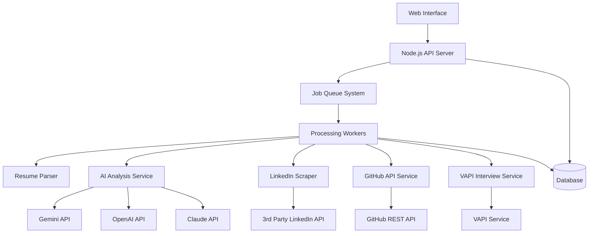

# Design Document

## Overview

The Job Candidate Filtering Funnel System is a Node.js-based application that processes candidate resumes through multiple AI-powered analysis stages. The system is designed as an MVP to handle 100 resumes per batch, focusing on filtering large candidate pools down to the most qualified candidates for human interviews. The architecture supports multiple AI providers (Gemini, GPT, Claude) and integrates with third-party services for LinkedIn scraping, GitHub analysis, and AI-powered phone interviews via VAPI.

## Architecture

### High-Level Architecture



### Technology Stack

- **Backend**: Node.js with Express.js
- **Database**: MongoDB for document storage, Redis for caching and job queues
- **Queue System**: Bull Queue with Redis
- **AI Providers**: Gemini, OpenAI GPT, Claude (configurable)
- **LinkedIn Scraping**: Third-party LinkedIn scraper service
- **GitHub Integration**: GitHub REST API
- **AI Calling**: VAPI service
- **File Processing**: PDF parsing libraries (pdf-parse, pdf2pic)
- **Frontend**: React.js for admin interface

## Components and Interfaces

### 1. Job Profile Management Service

**Purpose**: Manages job profiles with dynamic scoring weights

**Key Features**:
- CRUD operations for job profiles
- Dynamic weight configuration for scoring stages
- Job-specific interview questions management

**Interface**:
```typescript
interface JobProfile {
  id: string;
  title: string;
  description: string;
  requiredSkills: string[];
  experienceLevel: string;
  scoringWeights: {
    resumeAnalysis: number;
    linkedInAnalysis: number;
    githubAnalysis: number;
    interviewPerformance: number;
  };
  interviewQuestions: string[];
  createdAt: Date;
  updatedAt: Date;
}
```

### 2. Resume Processing Service

**Purpose**: Handles bulk resume upload and text extraction

**Key Features**:
- PDF text extraction
- Contact information parsing (phone, email)
- URL extraction (LinkedIn, GitHub, project links)
- Batch processing with progress tracking

**Interface**:
```typescript
interface ResumeData {
  id: string;
  fileName: string;
  extractedText: string;
  contactInfo: {
    phone?: string;
    email?: string;
    linkedInUrl?: string;
    githubUrl?: string;
    projectUrls: string[];
  };
  processingStatus: 'pending' | 'completed' | 'failed';
  extractionErrors?: string[];
}
```

### 3. AI Analysis Service

**Purpose**: Multi-provider AI analysis with fallback support

**Key Features**:
- Provider switching (Gemini → GPT → Claude)
- Resume-to-job matching analysis
- Structured scoring with reasoning
- Rate limiting and error handling

**Interface**:
```typescript
interface AIAnalysisResult {
  candidateId: string;
  provider: 'gemini' | 'openai' | 'claude';
  relevanceScore: number; // 0-100
  skillsMatch: {
    matched: string[];
    missing: string[];
  };
  experienceAssessment: string;
  reasoning: string;
  confidence: number;
}
```

### 4. LinkedIn Analysis Service

**Purpose**: Professional profile verification and analysis

**Key Features**:
- Third-party LinkedIn scraper integration
- Professional experience validation
- Network and endorsement analysis
- Privacy handling for inaccessible profiles

**Interface**:
```typescript
interface LinkedInAnalysis {
  candidateId: string;
  profileAccessible: boolean;
  professionalScore: number; // 0-100
  experience: {
    totalYears: number;
    relevantRoles: number;
    companyQuality: string;
  };
  network: {
    connections: number;
    endorsements: number;
  };
  credibilityIndicators: string[];
}
```

### 5. GitHub Analysis Service

**Purpose**: Technical credibility assessment through code analysis

**Key Features**:
- Profile statistics analysis
- Repository quality assessment
- Commit history verification for resume projects
- Clone detection for project authenticity

**Interface**:
```typescript
interface GitHubAnalysis {
  candidateId: string;
  profileStats: {
    publicRepos: number;
    followers: number;
    contributionStreak: number;
    totalCommits: number;
  };
  technicalScore: number; // 0-100
  projectAuthenticity: {
    resumeProjects: Array<{
      url: string;
      isAuthentic: boolean;
      commitHistory: number;
      branchingPattern: string;
      codeQuality: string;
    }>;
  };
  skillsEvidence: string[];
}
```

### 6. VAPI Interview Service

**Purpose**: AI-powered phone interview management

**Key Features**:
- Automated call scheduling
- Dynamic question generation based on job profile
- Real-time transcript generation
- Call quality monitoring

**Interface**:
```typescript
interface InterviewSession {
  candidateId: string;
  jobProfileId: string;
  vapiCallId: string;
  scheduledAt: Date;
  status: 'scheduled' | 'in-progress' | 'completed' | 'failed' | 'no-answer';
  transcript?: string;
  duration?: number;
  callQuality: 'excellent' | 'good' | 'poor';
  retryCount: number;
}
```

### 7. Scoring and Ranking Service

**Purpose**: Comprehensive candidate evaluation with dynamic weights

**Key Features**:
- Weighted score calculation using job profile weights
- Candidate ranking and filtering
- Threshold-based filtering
- Detailed score breakdown

**Interface**:
```typescript
interface CandidateScore {
  candidateId: string;
  jobProfileId: string;
  compositeScore: number; // 0-100
  stageScores: {
    resumeAnalysis: number;
    linkedInAnalysis: number;
    githubAnalysis: number;
    interviewPerformance: number;
  };
  appliedWeights: {
    resumeAnalysis: number;
    linkedInAnalysis: number;
    githubAnalysis: number;
    interviewPerformance: number;
  };
  rank: number;
  recommendation: 'strong-hire' | 'hire' | 'maybe' | 'no-hire';
  reasoning: string;
}
```

## Data Models

### Core Entities

```typescript
// Candidate Entity
interface Candidate {
  id: string;
  resumeData: ResumeData;
  aiAnalysis?: AIAnalysisResult;
  linkedInAnalysis?: LinkedInAnalysis;
  githubAnalysis?: GitHubAnalysis;
  interviewSession?: InterviewSession;
  finalScore?: CandidateScore;
  processingStage: 'resume' | 'ai-analysis' | 'linkedin' | 'github' | 'interview' | 'scoring' | 'completed';
  createdAt: Date;
  updatedAt: Date;
}

// Batch Processing Entity
interface ProcessingBatch {
  id: string;
  jobProfileId: string;
  totalCandidates: number;
  processedCandidates: number;
  failedCandidates: number;
  status: 'processing' | 'completed' | 'failed';
  startedAt: Date;
  completedAt?: Date;
  candidateIds: string[];
}
```

## Error Handling

### AI Provider Fallback Strategy

1. **Primary Provider (Gemini)**: First attempt with 3 retries
2. **Secondary Provider (OpenAI)**: Fallback with 2 retries  
3. **Tertiary Provider (Claude)**: Final fallback with 1 retry
4. **Failure Handling**: Mark analysis as incomplete, continue processing

### Service-Specific Error Handling

- **LinkedIn Scraping**: Handle rate limits, private profiles, and service downtime
- **GitHub API**: Manage API rate limits and private repositories
- **VAPI Service**: Handle call failures, no-answer scenarios, and poor audio quality
- **Resume Processing**: Continue batch processing despite individual file failures

### Data Integrity

- **Atomic Operations**: Ensure candidate data consistency across processing stages
- **Rollback Mechanisms**: Ability to restart failed processing stages
- **Audit Logging**: Track all processing steps and errors for debugging

## Testing Strategy

### Unit Testing

- **Service Layer**: Test each analysis service independently with mocked dependencies
- **Data Models**: Validate data transformation and validation logic
- **Scoring Algorithm**: Test weighted scoring calculations with various scenarios

### Integration Testing

- **API Endpoints**: Test complete request/response cycles
- **External Services**: Test integration with LinkedIn scraper, GitHub API, and VAPI
- **Database Operations**: Verify data persistence and retrieval

### End-to-End Testing

- **Complete Pipeline**: Test full candidate processing from resume upload to final scoring
- **Batch Processing**: Validate handling of multiple candidates simultaneously
- **Error Scenarios**: Test system behavior under various failure conditions

### Performance Testing

- **Load Testing**: Verify system performance with 100 concurrent resume processing
- **API Response Times**: Ensure sub-5-second response times for UI interactions
- **Memory Usage**: Monitor memory consumption during large batch processing

### AI Model Testing

- **Response Quality**: Validate AI analysis accuracy against known good/bad candidates
- **Provider Consistency**: Compare results across different AI providers
- **Edge Cases**: Test with unusual resume formats and incomplete data

## Security Considerations

### Data Privacy

- **PII Handling**: Encrypt sensitive candidate information at rest and in transit
- **Data Retention**: Implement configurable data retention policies
- **Access Control**: Role-based access to candidate data and system functions

### API Security

- **Authentication**: JWT-based authentication for API access
- **Rate Limiting**: Prevent abuse of external API integrations
- **Input Validation**: Sanitize all user inputs and file uploads

### Third-Party Integration Security

- **API Key Management**: Secure storage and rotation of external service credentials
- **Network Security**: Use HTTPS for all external communications
- **Audit Logging**: Log all external API calls for security monitoring