<div align="center">

# The Human Funnel

### Automating the messy part of recruitment, from 10,000 applicants to your top 100—fast, fair, and reliably.


# Architecture 

```mermaid
graph TD
    A[📄 Resume Upload] --> B[🤖 AI Resume Analysis]
    B --> C[🎯 Skill Matching & Scoring]
    
    C --> D[💼 LinkedIn Analysis]
    D --> D1[Network & Credibility]
    D --> D2[Experience Verification]
    D --> D3[Professional Engagement]
    
    C --> E[💻 GitHub Analysis]
    E --> E1[Commit History]
    E --> E2[ Find copy-paste/fake projects]
    E --> E3[Open Source Contributions]
    E --> E4[PRs, Reviews & Issues]
    
    D1 --> F[📞 AI Interview Call]
    D2 --> F
    D3 --> F
    E1 --> F
    E2 --> F
    E3 --> F
    E4 --> F
    
    F --> G[❓ Job-Specific Questions]
    G --> H[📊 AI Analysis & Scoring]
    H --> I[📝 Recommendation Generation]
    I --> J[🏆 Final Ranking]
    
    style A fill:#667eea,color:#fff
    style J fill:#764ba2,color:#fff
    style F fill:#f093fb,color:#fff
    style H fill:#4facfe,color:#fff
```



---
**Founder or hiring team manager? [Reach out to try the Enterprise Version!](https://thehumanfunnel.in/)**

---
</div>

## Features

### Core Analysis Pipeline
- **Resume Processing**: PDF text extraction with contact information parsing
- **AI Analysis**: Multi-provider AI resume analysis (Gemini, OpenAI, Claude) with automatic fallback
- **LinkedIn Analysis**: Professional profile evaluation and credibility scoring
- **GitHub Analysis**: Technical skills assessment and project authenticity verification
- **VAPI Interviews**: Automated AI-powered phone interviews with transcript analysis
- **Interview Analysis**: AI-powered transcript evaluation with detailed scoring and feedback
- **Comprehensive Scoring**: Weighted scoring system combining all analysis stages with intelligent normalization
- **Candidate Ranking**: Advanced ranking algorithms with customizable thresholds and filtering
- **Report Generation**: Professional PDF reports and CSV exports for candidates and batch summaries

### Candidate Management System
- **Advanced Search & Filtering**: Multi-criteria candidate search with pagination and sorting
- **Processing Status Tracking**: Real-time monitoring of candidate progress through analysis stages
- **Batch Processing Management**: Track and monitor large-scale candidate processing operations
- **Data Export**: Flexible CSV and JSON export with customizable fields and filtering
- **Top Candidates Identification**: Automated ranking and selection of highest-scoring candidates

### Advanced Capabilities
- **Multi-Provider AI**: Automatic fallback between AI providers for reliability
- **Batch Processing**: Handle hundreds of candidates simultaneously with Redis-backed job queues
- **Real-time Progress**: Track processing status across all analysis stages
- **Quality Assessment**: Automatic quality validation for transcripts and profiles
- **Manual Review Flags**: Intelligent flagging of candidates requiring human review
- **Intelligent Scoring**: Weighted composite scoring with missing data normalization
- **Advanced Ranking**: Configurable thresholds and stage-specific filtering
- **Professional Reports**: PDF generation with comprehensive candidate assessments
- **Data Export**: CSV export capabilities for external analysis and record keeping
- **Caching Layer**: Redis-powered caching for improved performance and reduced API calls

### Frontend Management Interface
- **Job Profile Management**: Create and manage job profiles with dynamic scoring weights
- **Drag-and-Drop Resume Upload**: Bulk upload interface supporting up to 10,000 PDF files
- **Advanced Candidate Dashboard**: Filter, sort, and view candidates with detailed analysis results
- **Real-time Progress Tracking**: Monitor batch processing with live updates and ETA calculations
- **Report Generation**: Export individual candidate reports and batch summaries in PDF/CSV formats
- **Responsive Design**: Modern Material-UI interface optimized for desktop and tablet use

## Project Structure

```
src/                      # Backend source code
├── index.ts              # Main application entry point
├── models/               # Data models and TypeScript interfaces
│   ├── interfaces.ts     # Core data interfaces
│   └── schemas.ts        # MongoDB schemas
├── services/             # Business logic services
│   ├── aiAnalysisService.ts        # Multi-provider AI resume analysis
│   ├── githubAnalysisService.ts    # GitHub profile and project analysis
│   ├── linkedInAnalysisService.ts  # LinkedIn professional analysis
│   ├── vapiInterviewService.ts     # VAPI phone interview integration
│   ├── interviewAnalysisService.ts # AI transcript analysis
│   ├── scoringService.ts           # Comprehensive scoring and ranking system
│   ├── reportGenerationService.ts  # PDF and CSV report generation
│   ├── candidateService.ts         # Candidate management and search
│   ├── resumeProcessingService.ts  # PDF processing and text extraction
│   └── jobProfileService.ts        # Job profile management
├── routes/               # API route definitions
│   ├── aiAnalysisRoutes.ts         # AI analysis endpoints
│   ├── githubAnalysisRoutes.ts     # GitHub analysis endpoints
│   ├── linkedInAnalysisRoutes.ts   # LinkedIn analysis endpoints
│   ├── vapiInterviewRoutes.ts      # Interview scheduling endpoints
│   ├── interviewAnalysisRoutes.ts  # Transcript analysis endpoints
│   ├── scoringRoutes.ts            # Scoring and ranking endpoints
│   ├── reportRoutes.ts             # Report generation endpoints
│   └── jobProfileRoutes.ts         # Job profile management endpoints
├── middleware/           # Express middleware
├── queues/               # Job queue definitions and processors
├── test/                 # Comprehensive test suites
└── utils/                # Utility functions and helpers
    ├── config.ts         # Configuration management
    ├── database.ts       # Database connection utilities
    ├── redis.ts          # Redis connection and client management
    ├── logger.ts         # Logging utilities
    └── validation.ts     # Validation utilities

frontend/                 # React.js frontend application
├── public/               # Static assets
│   └── index.html        # HTML template
├── src/                  # Frontend source code
│   ├── components/       # React components
│   │   ├── JobProfileManager.tsx    # Job profile CRUD operations
│   │   ├── ResumeUploader.tsx       # File upload with drag-and-drop
│   │   ├── CandidateDashboard.tsx   # Candidate listing and filtering
│   │   └── BatchProgress.tsx        # Real-time processing status
│   ├── services/         # API service layer
│   │   └── api.ts        # Backend API integration
│   ├── App.tsx           # Main application component
│   └── index.tsx         # Application entry point
├── build/                # Production build output (generated)
├── package.json          # Frontend dependencies
└── tsconfig.json         # TypeScript configuration

reports/                  # Generated reports directory (auto-created)
├── candidate_*.pdf       # Individual candidate assessment reports
├── batch_summary_*.pdf   # Batch processing summary reports
└── candidates_export_*.csv # CSV data exports
```

## Quick Start

1. **Clone and install dependencies:**
   ```bash
   git clone <repository-url>
   cd job-candidate-filtering-funnel
   npm install
   npm run install:frontend
   ```

2. **Configure environment variables:**
   ```bash
   cp .env.example .env
   # Edit .env with your actual configuration values
   ```

3. **Set up required services:**
   - MongoDB database
   - Redis server (for caching and job queues)
   - AI provider API keys (at least one: Gemini, OpenAI, or Claude)
   - Optional: GitHub token, LinkedIn scraper API, VAPI API key

4. **Build and start:**
   ```bash
   npm run build:all
   npm start
   ```
   The application will be available at `http://localhost:3000`

5. **Development mode:**
   ```bash
   # Backend development (API server)
   npm run dev
   
   # Frontend development (React app)
   npm run dev:frontend
   ```
   - Backend API: `http://localhost:3000/api`
   - Frontend UI: `http://localhost:3001`

## Setup

### Prerequisites
- Node.js 18+ and npm
- MongoDB 4.4+
- Redis 6.0+ (for caching and job queues)
- At least one AI provider API key
- Chrome/Chromium browser (for PDF generation via Puppeteer)

### Installation Steps

1. **Install dependencies:**
   ```bash
   npm install
   ```

2. **Configure environment variables:**
   ```bash
   cp .env.example .env
   # Edit .env with your actual configuration values
   ```

3. **Build the project:**
   ```bash
   npm run build
   ```

4. **Start Redis server:**
   ```bash
   # On macOS with Homebrew
   brew services start redis
   
   # On Ubuntu/Debian
   sudo systemctl start redis-server
   
   # Using Docker
   docker run -d -p 6379:6379 redis:latest
   ```

5. **Start the application:**
   ```bash
   npm start
   ```

## Development

- **Development mode with auto-reload:**
  ```bash
  npm run dev
  ```

- **Build project:**
  ```bash
  npm run build
  ```

- **Clean build artifacts:**
  ```bash
  npm run clean
  ```

## Environment Variables

See `.env.example` for all required environment variables including:

### Database Connections
- `MONGODB_URI` - MongoDB connection string
- `MONGODB_DB_NAME` - MongoDB database name
- `REDIS_HOST` - Redis server host (default: localhost)
- `REDIS_PORT` - Redis server port (default: 6379)
- `REDIS_PASSWORD` - Redis server password (optional)

### AI Provider API Keys
- `GEMINI_API_KEY` - Google Gemini API key
- `OPENAI_API_KEY` - OpenAI API key
- `CLAUDE_API_KEY` - Anthropic Claude API key

### External Service Configurations
- `GITHUB_TOKEN` - GitHub API token for profile analysis
- `LINKEDIN_SCRAPER_API_KEY` - Third-party LinkedIn scraper API key
- `LINKEDIN_SCRAPER_BASE_URL` - LinkedIn scraper service URL
- `VAPI_API_KEY` - VAPI service API key for phone interviews
- `VAPI_BASE_URL` - VAPI service base URL

### Processing Settings
- `MAX_RETRIES` - Maximum retry attempts for failed operations
- `PROCESSING_TIMEOUT` - Timeout for long-running operations
- `API_RATE_LIMIT` - Rate limiting for API endpoints


## Key Features Deep Dive

### Candidate Management Service

The Candidate Management Service provides comprehensive candidate lifecycle management with advanced search, filtering, and export capabilities.

#### Advanced Search and Filtering
- **Multi-Criteria Filtering**: Filter by job profile, processing stage, score ranges, recommendations, and more
- **Date Range Filtering**: Search candidates by creation date ranges
- **Profile Completeness**: Filter by LinkedIn/GitHub profile availability
- **Interview Status**: Filter by interview completion status
- **Flexible Pagination**: Configurable page size and navigation
- **Multi-Field Sorting**: Sort by score, creation date, or candidate name

#### Processing Status Tracking
- **Real-Time Progress**: Track candidates through all processing stages
- **Stage Completion Status**: Monitor resume processing, AI analysis, LinkedIn/GitHub analysis, interviews, and scoring
- **Error Detection**: Identify and report processing failures at each stage
- **Batch Progress Monitoring**: Track progress of large-scale batch processing operations

#### Data Export Capabilities
- **Multiple Formats**: Export to CSV or JSON formats
- **Flexible Field Selection**: Choose specific fields for export
- **Detailed Reports**: Include comprehensive analysis details in exports
- **Large Dataset Support**: Handle exports of up to 10,000 candidates
- **Custom Filtering**: Apply any search filters to export subsets

#### Top Candidate Identification
- **Automatic Ranking**: Identify highest-scoring candidates for specific jobs
- **Configurable Limits**: Specify number of top candidates to retrieve
- **Completion Filtering**: Only include fully processed candidates
- **Score-Based Sorting**: Automatic sorting by composite scores

### Comprehensive Scoring Service

The Scoring Service provides intelligent candidate evaluation and ranking with the following capabilities:

#### Multi-Stage Score Integration
- **Resume Analysis**: AI-powered resume evaluation (0-100 score)
- **LinkedIn Analysis**: Professional credibility assessment (0-100 score)
- **GitHub Analysis**: Technical skills and project authenticity (0-100 score)
- **Interview Performance**: AI transcript analysis and evaluation (0-100 score)

#### Weighted Scoring Algorithm
- **Configurable Weights**: Customizable weight distribution across analysis stages
- **Intelligent Normalization**: Automatic adjustment for missing analysis stages
- **Composite Score Calculation**: Weighted average with normalization (0-100 final score)

#### Advanced Ranking Features
- **Threshold-Based Recommendations**: Configurable thresholds for hire/no-hire decisions
- **Stage-Specific Filtering**: Minimum score requirements for individual analysis stages
- **Detailed Reasoning**: AI-generated explanations for scores and recommendations
- **Missing Stage Handling**: Graceful handling of incomplete candidate profiles

#### Recommendation Categories
- **Strong Hire (85+)**: Exceptional candidates with outstanding performance
- **Hire (70-84)**: Good candidates who meet most requirements
- **Maybe (50-69)**: Candidates with potential but some concerns
- **No Hire (<50)**: Candidates who don't meet minimum requirements

### Report Generation Service

The Report Generation Service provides comprehensive reporting capabilities for individual candidates and batch processing with the following features:

#### Professional PDF Reports
- **Individual Candidate Reports**: Detailed assessment reports with all analysis results
- **Batch Summary Reports**: Executive summaries with processing statistics and top candidates
- **Professional Formatting**: Clean, print-ready PDF layout with visual score indicators
- **Incomplete Data Handling**: Graceful handling of partial analysis results

#### Data Export Capabilities
- **CSV Export**: Structured data export for spreadsheet analysis
- **Configurable Fields**: Comprehensive candidate data including scores, recommendations, and contact info
- **Batch Processing**: Export multiple candidates simultaneously

#### Report Sections
- **Candidate Information**: Contact details, resume file, processing status
- **Final Scores**: Composite scores with visual indicators and stage breakdowns
- **AI Analysis Results**: Skills matching, experience assessment, and reasoning
- **LinkedIn Analysis**: Professional credibility and network metrics
- **GitHub Analysis**: Technical skills evidence and project authenticity
- **Interview Analysis**: Performance scores, communication assessment, and detailed feedback
- **Recommendations**: Final hiring recommendations with detailed reasoning

#### File Management
- **Automatic Directory Creation**: Reports stored in dedicated `reports/` directory
- **Unique File Naming**: Timestamp-based naming prevents conflicts
- **Multiple Formats**: PDF for presentation, CSV for data analysis
- **Download Support**: Direct file download via API endpoints

### Interview Analysis Service

The Interview Analysis Service provides comprehensive AI-powered evaluation of interview transcripts with the following capabilities:

#### Multi-Dimensional Scoring
- **Performance Score (0-100)**: Overall interview performance evaluation
- **Communication Score (0-100)**: Assessment of communication skills and clarity
- **Technical Score (0-100)**: Evaluation of technical knowledge and competency
- **Competency Scores**: Individual scoring for each required job skill

#### Quality Assessment
- **Transcript Quality**: Automatic assessment (excellent/good/poor)
- **Manual Review Flags**: Intelligent flagging for human review when needed
- **Confidence Scoring**: AI confidence level in the analysis (0-100)

#### Detailed Feedback
- **Strengths**: Identified candidate strengths
- **Weaknesses**: Areas for improvement
- **Recommendations**: Hiring recommendations and next steps
- **Response Analysis**: Question-by-question breakdown with specific feedback

#### AI Provider Fallback
- **Primary**: Gemini API (3 retries)
- **Secondary**: OpenAI GPT (2 retries)
- **Tertiary**: Claude API (1 retry)
- **Automatic Fallback**: Seamless provider switching on failures

### Multi-Provider AI Architecture

All AI-powered services (resume analysis, interview analysis) use a robust multi-provider architecture:

1. **Reliability**: Automatic fallback ensures high availability
2. **Quality**: Different AI models provide diverse perspectives
3. **Cost Optimization**: Primary provider selection based on cost/performance
4. **Scalability**: Load distribution across multiple providers

## Documentation

Comprehensive documentation is available in the `docs/` directory:

### Service Documentation
- **[AI Analysis Service](docs/ai-analysis-service.md)** - Multi-provider AI resume analysis
- **[GitHub Analysis Service](docs/github-analysis-service.md)** - GitHub profile and repository analysis
- **[LinkedIn Analysis Service](docs/linkedin-analysis-service.md)** - LinkedIn professional profile analysis
- **[VAPI Interview Service](docs/vapi-interview-service.md)** - Automated phone interview integration
- **[Interview Analysis Service](docs/interview-analysis-service.md)** - AI-powered transcript analysis
- **[Scoring Service](docs/scoring-service.md)** - Comprehensive scoring and ranking system
- **[Report Generation Service](docs/report-generation-service.md)** - PDF and CSV report generation

### User and Operations Documentation
- **[API Documentation](docs/api-documentation.md)** - Complete REST API reference with examples
- **[User Manual](docs/user-manual.md)** - Step-by-step guide for system operation
- **[Deployment Guide](DEPLOYMENT.md)** - Production deployment and configuration
- **[Troubleshooting Guide](docs/troubleshooting-guide.md)** - Common issues and solutions)** - PDF and CSV report generation
- **[Resume Processing API](docs/resume-processing-api.md)** - PDF processing and text extraction
- **[Job Profile API](docs/job-profile-api.md)** - Job profile management

**Note**: The Candidate Management Service is documented inline in this README. Additional detailed documentation will be added to the `docs/` directory as the service evolves.

Each service documentation includes:
- API endpoint specifications
- Configuration requirements
- Usage examples
- Error handling
- Testing guidelines
- Troubleshooting guides


## Contributing

1. Fork the repository
2. Create a feature branch (`git checkout -b feature/amazing-feature`)
3. Commit your changes (`git commit -m 'Add amazing feature'`)
4. Push to the branch (`git push origin feature/amazing-feature`)
5. Open a Pull Request

## License

This project is licensed under the ISC License - see the LICENSE file for details.
