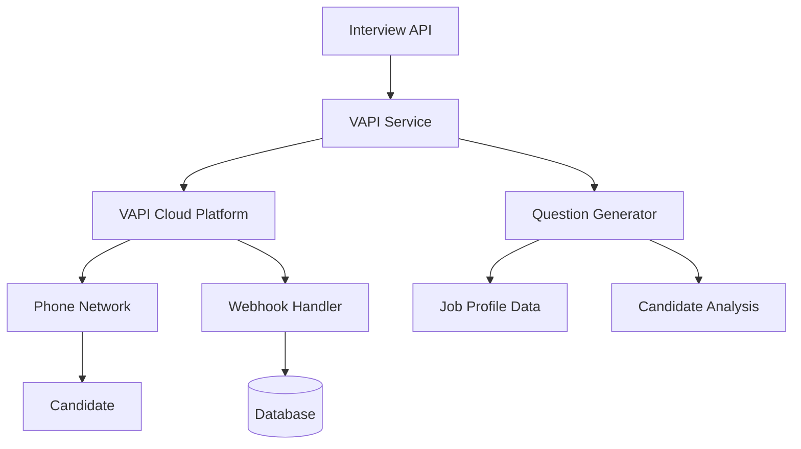

# VAPI Interview Service Documentation

## Overview

The VAPI Interview Service integrates with VAPI (Voice AI Platform Interface) to conduct automated AI-powered phone interviews with job candidates. This service handles call scheduling, dynamic question generation, transcript processing, and call quality monitoring.

## Features

- **Automated Call Scheduling**: Schedule AI phone interviews with candidates
- **Dynamic Question Generation**: Generate interview questions based on job profiles and candidate data
- **Multi-Provider AI Support**: Uses OpenAI GPT-4 for conversation intelligence
- **Call Quality Monitoring**: Assess call quality and transcript completeness
- **Retry Logic**: Automatic retry for failed or unanswered calls (up to 2 retries)
- **Real-time Webhooks**: Process VAPI webhooks for live call status updates
- **Transcript Processing**: Extract and analyze interview transcripts

## Architecture



## Configuration

### Environment Variables

```bash
# VAPI Configuration
VAPI_API_KEY=your_vapi_api_key_here
VAPI_BASE_URL=https://api.vapi.ai

# Optional: Custom voice settings
VAPI_VOICE_PROVIDER=elevenlabs
VAPI_VOICE_ID=pNInz6obpgDQGcFmaJgB
```

### VAPI Account Setup

1. Sign up for a VAPI account at [vapi.ai](https://vapi.ai)
2. Obtain your API key from the dashboard
3. Configure webhook endpoints for real-time updates
4. Set up billing for call credits

## API Endpoints

### Schedule Interview

**POST** `/api/vapi/schedule-interview`

Schedule an AI phone interview for a candidate.

**Request Body:**
```json
{
  "candidateId": "candidate-123",
  "jobProfileId": "job-456",
  "phoneNumber": "+1-555-123-4567"
}
```

**Response:**
```json
{
  "success": true,
  "data": {
    "candidateId": "candidate-123",
    "jobProfileId": "job-456",
    "vapiCallId": "vapi-call-789",
    "scheduledAt": "2024-01-01T10:00:00Z",
    "status": "scheduled",
    "callQuality": "good",
    "retryCount": 0
  },
  "message": "Interview scheduled successfully"
}
```

### Get Interview Status

**GET** `/api/vapi/interview/:sessionId/status`

Get current status and details of an interview session.

**Response:**
```json
{
  "success": true,
  "data": {
    "session": {
      "candidateId": "candidate-123",
      "jobProfileId": "job-456",
      "vapiCallId": "vapi-call-789",
      "status": "completed",
      "transcript": "Interview transcript here...",
      "duration": 900,
      "callQuality": "excellent"
    },
    "vapiCall": {
      "id": "vapi-call-789",
      "status": "ended",
      "endedReason": "customer-ended-call",
      "duration": 900
    }
  }
}
```

### Retry Interview

**POST** `/api/vapi/interview/:sessionId/retry`

Retry a failed or unanswered interview.

**Request Body:**
```json
{
  "phoneNumber": "+1-555-123-4567"
}
```

### Webhook Handler

**POST** `/api/vapi/webhook`

Handle VAPI webhooks for real-time call updates.

**Webhook Payload:**
```json
{
  "message": {
    "type": "status-update",
    "call": {
      "id": "vapi-call-789",
      "status": "in-progress",
      "phoneNumber": "+15551234567"
    },
    "timestamp": "2024-01-01T10:00:00Z"
  }
}
```

## Service Usage

### Basic Interview Scheduling

```typescript
import { vapiInterviewService } from '../services/vapiInterviewService';

// Schedule an interview
const interviewSession = await vapiInterviewService.scheduleInterview(
  candidate,
  jobProfile,
  '+1-555-123-4567'
);

console.log('Interview scheduled:', interviewSession.vapiCallId);
```

### Monitoring Interview Progress

```typescript
// Get current call status
const callStatus = await vapiInterviewService.getCallStatus(interviewSession.vapiCallId);

// Update session based on VAPI data
const updatedSession = await vapiInterviewService.updateInterviewSession(
  interviewSession,
  callStatus
);

console.log('Interview status:', updatedSession.status);
```

### Handling Failed Interviews

```typescript
// Retry a failed interview
if (interviewSession.status === 'no-answer' && interviewSession.retryCount < 2) {
  const retriedSession = await vapiInterviewService.retryInterview(
    interviewSession,
    candidate,
    jobProfile,
    phoneNumber
  );
  
  console.log('Interview retried:', retriedSession.vapiCallId);
}
```

## Question Generation

The service automatically generates interview questions based on:

### Job Profile Data
- Required skills and technologies
- Experience level (Entry, Mid, Senior)
- Custom interview questions from job profile
- Role-specific competencies

### Candidate Analysis
- AI analysis results (matched/missing skills)
- Resume content and experience
- GitHub and LinkedIn profile data
- Previous interview performance

### Question Types

**Skill-Based Questions:**
- "Can you describe your experience with {skill}?"
- "How have you used {technology} in your previous projects?"
- "What challenges have you faced when working with {framework}?"

**Experience-Level Questions:**

*Senior Level:*
- "Can you describe a time when you had to mentor junior team members?"
- "How do you approach technical decision-making in complex projects?"

*Mid Level:*
- "Describe a challenging project you've worked on and how you overcame obstacles."
- "How do you stay updated with new technologies in your field?"

*Entry Level:*
- "What interests you most about this role and our company?"
- "Can you tell me about a project you're particularly proud of?"

## Call Quality Assessment

The service automatically assesses call quality based on:

### Duration Metrics
- **Excellent**: 10+ minutes with complete transcript
- **Good**: 5+ minutes with transcript or 2+ minutes minimum
- **Poor**: Less than 2 minutes or no meaningful transcript

### Transcript Quality
- Transcript completeness and length
- Conversation flow and coherence
- Technical discussion depth
- Communication clarity

### Call Completion
- Successful call connection
- Natural conversation ending
- Minimal technical issues
- Candidate engagement level

## Error Handling

### Common Error Scenarios

**Invalid Phone Number:**
```typescript
// Validates US phone number formats
if (!this.isValidPhoneNumber(phoneNumber)) {
  throw new Error('Invalid or missing phone number');
}
```

**VAPI API Errors:**
- **400 Bad Request**: Invalid call parameters
- **401 Unauthorized**: Invalid API key
- **402 Payment Required**: Insufficient credits
- **429 Rate Limited**: Too many requests

**Retry Logic:**
- Exponential backoff for temporary failures
- Maximum 3 attempts per API call
- Different retry strategies for different error types

### Network Issues
```typescript
// Automatic retry with exponential backoff
for (let attempt = 1; attempt <= this.maxRetries; attempt++) {
  try {
    return await this.makeAPICall();
  } catch (error) {
    if (attempt < this.maxRetries) {
      const delay = this.retryDelay * Math.pow(2, attempt - 1);
      await this.delay(delay);
    }
  }
}
```

## Webhook Integration

### Webhook Types

**Status Updates:**
- Call queued, ringing, in-progress, ended
- Real-time status changes during call

**Transcript Updates:**
- Partial transcripts during call
- Final transcript on call completion

**Call Events:**
- Call start/end notifications
- Quality metrics and duration
- End reason (completed, no-answer, failed)

### Webhook Security

```typescript
// Verify webhook authenticity (implement based on VAPI documentation)
const isValidWebhook = this.verifyWebhookSignature(
  req.body,
  req.headers['x-vapi-signature']
);

if (!isValidWebhook) {
  return res.status(401).json({ error: 'Invalid webhook signature' });
}
```

## Performance Considerations

### Call Limits
- Monitor VAPI account credits and usage
- Implement rate limiting for API calls
- Queue interviews during high-volume periods

### Concurrent Calls
- VAPI supports multiple concurrent calls
- Monitor account limits and adjust accordingly
- Implement call scheduling to optimize costs

### Transcript Processing
- Process transcripts asynchronously
- Store transcripts for later analysis
- Implement transcript quality validation

## Testing

### Unit Tests
```bash
npm test -- vapiInterviewService.test.ts
```

### Integration Tests
```typescript
// Test with VAPI sandbox environment
const testResult = await vapiInterviewService.testConnection();
console.log('VAPI connection:', testResult);
```

### Mock Testing
```typescript
// Mock VAPI responses for development
jest.mock('axios');
mockedAxios.post.mockResolvedValue({
  data: { id: 'mock-call-id', status: 'queued' }
});
```

## Monitoring and Analytics

### Call Metrics
- Total interviews conducted
- Success/failure rates
- Average call duration
- Call quality distribution

### Cost Tracking
- VAPI credit usage
- Cost per interview
- Monthly spending analysis

### Performance Metrics
- API response times
- Webhook processing latency
- Error rates and types

## Best Practices

### Phone Number Handling
- Always validate phone numbers before calling
- Format numbers to E.164 standard (+1XXXXXXXXXX)
- Handle international numbers appropriately

### Question Optimization
- Limit interviews to 8-10 questions maximum
- Target 15-25 minute call duration
- Adapt questions based on candidate responses

### Error Recovery
- Implement graceful degradation for API failures
- Provide clear error messages to users
- Log detailed error information for debugging

### Privacy and Compliance
- Obtain consent before recording calls
- Store transcripts securely
- Comply with local recording laws
- Implement data retention policies

## Troubleshooting

### Common Issues

**Calls Not Connecting:**
- Verify phone number format
- Check VAPI account credits
- Validate API key configuration

**Poor Call Quality:**
- Check candidate's phone connection
- Verify VAPI voice settings
- Monitor background noise levels

**Webhook Failures:**
- Verify webhook URL accessibility
- Check webhook signature validation
- Monitor webhook processing errors

### Debug Mode
```typescript
// Enable detailed logging
process.env.VAPI_DEBUG = 'true';

// Test API connectivity
const connectionTest = await vapiInterviewService.testConnection();
const accountInfo = await vapiInterviewService.getAccountInfo();
```

## Future Enhancements

### Planned Features
- Multi-language interview support
- Custom voice training for company branding
- Advanced sentiment analysis during calls
- Integration with calendar systems for scheduling
- Automated follow-up call scheduling

### AI Improvements
- Dynamic question adaptation based on responses
- Real-time conversation coaching
- Automated interview scoring
- Personality assessment integration

### Analytics Dashboard
- Real-time call monitoring
- Interview performance analytics
- Candidate communication insights
- ROI and cost analysis tools